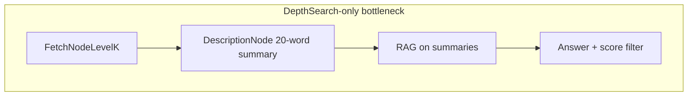
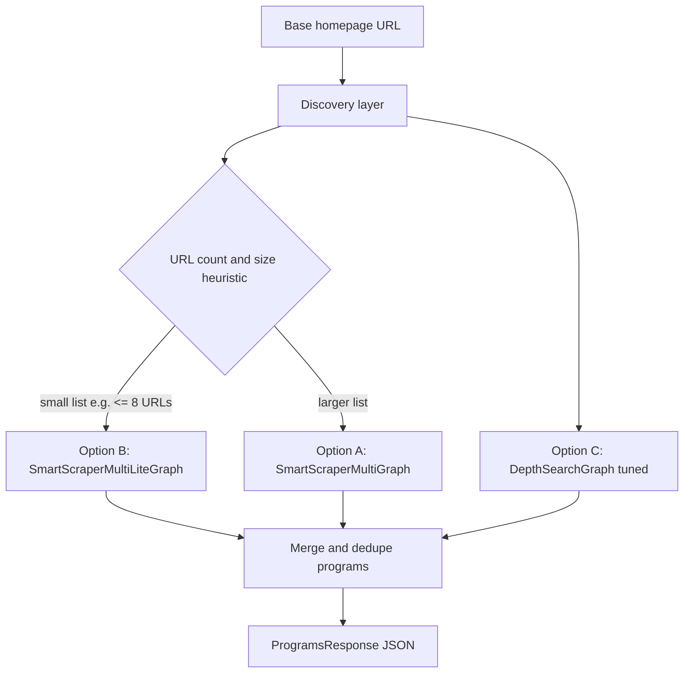

# Unified youth-program extraction (Options A + B + C)

## Problem recap (why DepthSearch alone fails)

[`DepthSearchGraph`](scrapegraphai/graphs/depth_search_graph.py) routes pages through [`DescriptionNode`](scrapegraphai/nodes/description_node.py) summaries (**max ~20 words**, [`DESCRIPTION_NODE_PROMPT`](scrapegraphai/prompts/description_node_prompts.py)), then [`RAGNode`](scrapegraphai/nodes/rag_node.py) retrieval and [`GenerateAnswerNodeKLevel`](scrapegraphai/nodes/generate_answer_node_k_level.py) with **`score > 0.5`**. That pipeline is optimized for coarse retrieval, **not** extracting dense program tables from many pages.

---

## Target architecture: one orchestrator, three techniques

### Layer 1 — Discovery (shared)

Implement **`discover_program_urls(base_url) -> list[str]`** in the example package (new module e.g. [`examples/youth_programs_academy/discovery.py`](examples/youth_programs_academy/discovery.py)):

1. **Sitemap**: GET `{scheme}{host}/sitemap.xml`; parse `<loc>`; follow `sitemapindex` children; filter same registrable domain.
2. **Homepage scrape**: single Playwright/Chromium fetch of homepage; extract `<a href>`; resolve relative URLs; same-domain filter.
3. **Rank / filter**: boost paths matching program-related tokens (`program`, `class`, `youth`, `junior`, `lesson`, `tennis`, `camp`, etc.) while allowing exclusions from business rules in [`prompt.py`](examples/youth_programs_academy/prompt.py) at extraction time (not necessarily at URL stage — prefer inclusive URLs then filter in LLM).
4. **Dedupe + cap**: canonical URLs (strip fragments); **`max_urls`** default ~40.

**Option C — discovery enrichment (not extraction yet):** optionally union URLs from a **shallow multi-hop internal link expansion** using the same semantics as [`FetchNodeLevelK`](scrapegraphai/nodes/fetch_node_level_k.py) (`depth`, `only_inside_links`) implemented either as:

- a thin helper that reuses library loaders to list discovered links without running Description+RAG, **or**
- a short dedicated crawl using existing patterns from `FetchNodeLevelK` (acceptable small duplication to avoid pulling full Depth pipeline).

Goal: **more candidate program pages** without summarizing them through DepthSearch.

---

### Layer 2 — Extraction routing (A vs B)

| Condition | Graph | Why |
|-----------|--------|-----|
| **`len(urls) <= lite_threshold`** (default **8**) | **[`SmartScraperMultiLiteGraph`](scrapegraphai/graphs/smart_scraper_multi_lite_graph.py)** (B) | Merges parsed docs **before** one structured merge — **maximum cross-page context** per LLM call when token budget allows. |
| **Otherwise** | **[`SmartScraperMultiGraph`](scrapegraphai/graphs/smart_scraper_multi_graph.py)** (A) | Per-URL [`SmartScraperGraph`](scrapegraphai/graphs/smart_scraper_graph.py) + [`MergeAnswersNode`](scrapegraphai/nodes/merge_answers_node.py) — scales better when many URLs would overflow a single context window. |

Shared inputs: [`build_prompt(base_url)`](examples/youth_programs_academy/prompt.py) (subject URL in prompt), [`ProgramsResponse`](examples/youth_programs_academy/schema.py), same LLM config knobs (`model`, `headless`, etc.).

---

### Layer 3 — Option C as extraction fusion (always-on configurable)

**DepthSearchGraph remains valuable** as a **parallel or conditional extractor**, not the sole path:

1. **When `len(urls) < min_urls`** (e.g. `< 5`): run **[`DepthSearchGraph`](scrapegraphai/graphs/depth_search_graph.py)** with **higher `depth`** (e.g. 3–4), **`only_inside_links: True`**, and preferably a **stronger model** (`openai/gpt-4o`) for the answer step — catches sites where discovery missed hidden links.
2. **Fusion**: combine **A/B `programs` list** with **DepthSearch `programs` list**:
   - **Dedupe** by normalized `(name.lower(), joiningLink)` or name-only if links duplicate.
   - Prefer **A/B record** when duplicate (richer structured extraction path).
3. **Optional “always merge” mode**: flag `--fusion-depth` runs DepthSearch even when discovery is healthy, then merges (higher cost, best recall).

**Optional library tweak (C — quality):** If Depth fusion still drops pages, consider lowering the **`0.5`** similarity cutoff in [`generate_answer_node_k_level.py`](scrapegraphai/nodes/generate_answer_node_k_level.py) or making it configurable via `graph_config` — document noise/recall tradeoff.

---

## Script changes ([`extract_youth_programs.py`](examples/youth_programs_academy/extract_youth_programs.py))

1. Replace single-graph flow with **orchestrator**: discovery → route A/B → optional/required DepthSearch → **`fuse_programs(primary, secondary)`**.
2. Add CLI flags: `--lite-threshold`, `--max-urls`, `--min-urls-for-depth`, `--fusion-depth always|sparse|never`, `--depth-search-depth`, `--models` split if desired (lite vs multi vs depth).
3. Keep `_serialize`; extend if merge answers return wrappers — normalize to **`{"programs": [...]}`** before dedupe.

---

## Operational notes

- **Cost**: Worst case = discovery + Multi × URLs + DepthSearch; gate with flags.
- **Accuracy**: Primary signal is **SmartScraper paths (A/B)**; DepthSearch is **recall insurance**.
- **Compliance**: Same crawling ethics as today; discovery should honor robots.txt where enforced by loaders.

---

## Deliverables checklist

- New **`discovery.py`** (+ optional **`fusion.py`** for dedupe).
- Refactored **`extract_youth_programs.py`** implementing routing + fusion.
- Short comments or **`examples/youth_programs_academy/README.md`** only if you explicitly want docs later (optional).
